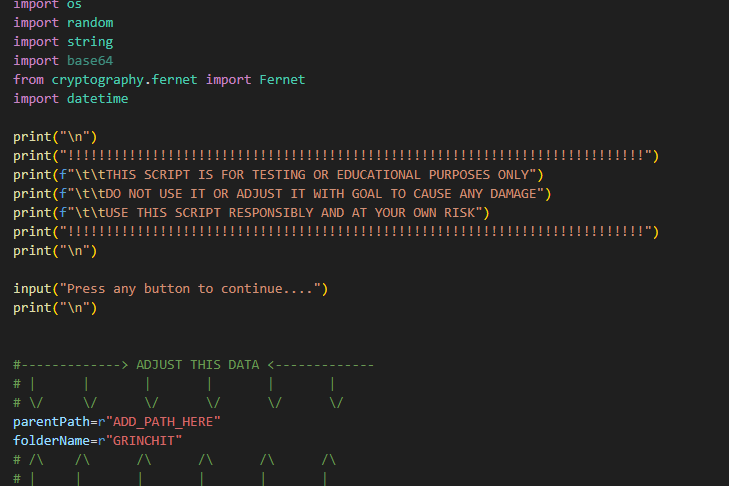
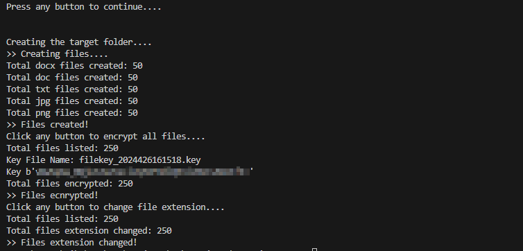
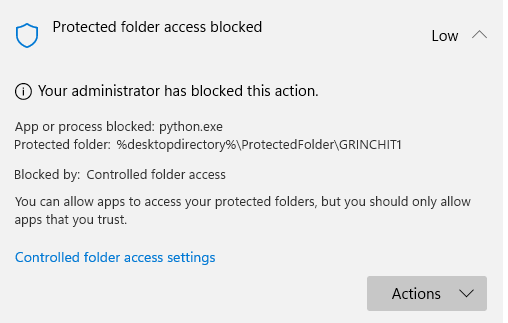

# PROJECT: RANSOWMARE SIMULATOR

_**DO NOT USE OR MODIFY THIS SCRIPT TO CAUSE ANY HARM TO YOUR SYSTEMS OR A THIRD PARTY \
USE THIS SCRIPT ONLY FOR TESTING OR EDUCATING PURPOSES \
HE AUTHOR IS NOT RESPONSIBLE FOR ANY MALFUNCTION OR DAMAGE CAUSED**_

 

## DESCRIPTION
Script to simulate a ransomware file activity. This script performs the following:
* Fill a folder with files, doc, docx, and jpeg
* Create a key and encrypts the files in the folder
* Change the file extension

## REQUIREMETNS
* Import the relative libaries
* Define the test folder path
* Define the test folder name. If not existed, the script will create one.

## CREDITS
_geeksforgeeks.org \
stackoverflow.com \
https://unsplash.com/@charlesdeluvio \
https://unsplash.com/@victor_vector \
https://unsplash.com/@alvannee_

## UPDATES
1. Microsoft Ransomware Protection notification \
   
